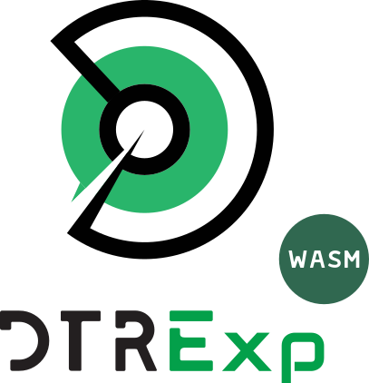

<p align="center"><picture><source media="(prefers-color-scheme: dark)" srcset="./.github/logo-dark.svg"></picture></p>

# dtrexp-wasm

<p align="center">
  <a href="https://www.npmjs.com/package/dtrexp-wasm"></a>
  
  
  
  <a href="LICENSE"></a>
</p>

> This module is **ESM** 🔆. Please [**read this**](https://gist.github.com/onury/d3f3d765d7db2e8b2d050d14315f2ac7).

**[DTRExp](https://github.com/DTRExp/dtrexp)** (read: "**DTR Expression**") evaluated by the [Rust core][rs], compiled to WebAssembly for JS hosts — browsers, Node, Deno, edge runtimes.

```
T0900:1800 E1:5          Mon–Fri, 09:00–18:00
E7#-1 M4                 last Sunday of April, every year
20200106/10D             every 10 days from 2020-01-06 (cron can't say this)
D13 E5                   every Friday the 13th (cron can't say this either)
```

Note that for most JS applications the reference implementation, **[dtrexp][js]**, is the right pick; it is pure TypeScript, zero-dependency, and implements the full Tier-2 API (`next()`, `describe()`, `toRRule()`…). This package exists for a different job: running the **Rust** evaluator itself in a JS host. Use it when your backend already standardizes on [dtrexp-rs][rs] and you want the same binary logic in the browser, or for cross-implementation parity checks against the reference.

## Install

```sh
npm i dtrexp-wasm
```

The wasm binary (~63 KB, ~29 KB gzipped) ships inside the package and instantiates at import; no fetch configuration, no separate asset step.

## Usage

```js
import { parse, validate } from 'dtrexp-wasm';

const dtr = parse('T0900:1800 E1:5'); // business hours
dtr.covers(new Date(), { tz: 'Europe/Berlin' }); // —> true
dtr.covers('2026-07-11T10:00:00Z'); // —> false (a Saturday, evaluated in UTC)

validate('D30 M2');
// —> { valid: true, errors: [], warnings: [{ message: '…unsatisfiable…', position: 0 }] }
```

The operation vocabulary is fixed across every DTRExp implementation ([API.md][api]); if you know one library, you know this one.

## API

### `parse(expression)`

- *expression* `String` — Required. The DTRExp source text.

**returns** a `DTRExp` instance.

Fails with a positioned `DTRExpSyntaxError` (`position`, `expression` properties) on invalid input. Parse failure is the only failure; a syntactically valid expression never fails later.

### `validate(expression)`

- *expression* `String` — Required. The DTRExp source text.

**returns** `{ valid, errors, warnings }`; every issue carries a `message` and a 0-based `position`. An expression can be valid **and** warned; that is the point of the distinction.

### `DTRExp#covers(instant [, opts])`

- *instant* `Date | number | string | { epochMilliseconds }` — Required. The instant to test.
- *opts.tz* `String` — Optional. An IANA time-zone identifier (e.g. `"Europe/Berlin"`). Default: **`"UTC"`**.

**returns** `Boolean`.

An unknown zone throws a `RangeError`; exactly what `Intl` itself throws for one.

### `DTRExp#warnings`

The spec §9.1 unsatisfiability warnings of a parsed expression; same content as `validate(source).warnings`, exposed on the instance so code that parses directly doesn't lose them.

## Time Zones

WebAssembly has no zoneinfo filesystem, so this package does not ship a time-zone database. Zone lookups are answered by the host's own IANA data through `Intl.DateTimeFormat` — the same technique the reference implementation uses — which keeps the binary small and the zone data exactly as current as the runtime's. `UTC` (the default) never touches the bridge and evaluates entirely inside the wasm module.

## Conformance

The spec's test vectors are the contract ([spec §12][spec-conformance]); this package vendors `vectors.json` and runs all of it in its test suite — 97 groups, 409 checks, including the coverage groups evaluated through the `Intl` zone bridge.

## Related Projects

- [**dtrexp** (spec)][spec] — the DTRExp specification (grammar, semantics, conformance vectors) this package implements.
- [**dtrexp-rs**][rs] — the Rust core this package compiles to WebAssembly.
- [**dtrexp-js**][js] — the reference implementation; the pure-TypeScript alternative on npm.
- [**dtrexp-py**][py] · [**dtrexp-go**][go] · [**dtrexp-swift**][swift] · [**dtrexp-java**][java] — the other implementations; same core interface.

## License

MIT — © 2026, Onur Yıldırım.

[js]: https://github.com/DTRExp/dtrexp-js
[rs]: https://github.com/DTRExp/dtrexp-rs
[api]: https://github.com/DTRExp/dtrexp/blob/main/API.md
[spec-conformance]: https://github.com/DTRExp/dtrexp/blob/main/spec.md#12-conformance
[spec]: https://github.com/DTRExp/dtrexp
[py]: https://github.com/DTRExp/dtrexp-py
[go]: https://github.com/DTRExp/dtrexp-go
[swift]: https://github.com/DTRExp/dtrexp-swift
[java]: https://github.com/DTRExp/dtrexp-java
